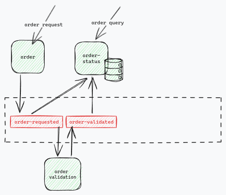

## Event sourcing & CQRS

Event sourcing is a data management approach that centers around events, recognizing them as the core building blocks of any system. These events, representing state changes, are stored in an immutable append-only log, preserving the order they occurred in. This approach offers a comprehensive audit trail of the system's activity and allows replaying the event log to reconstruct the current system state.

CQRS, or Command Query Responsibility Segregation, complements event sourcing by advocating for the separation of write operations (commands) and read operations (queries). This decoupling brings several advantages. Firstly, it allows for independent optimization of the write model, which might prioritize high throughput like Kafka, and the read model, which might focus on fast queries like a traditional database. Secondly, CQRS facilitates independent scaling of the read and write models based on their specific needs.

Event sourcing and CQRS work together seamlessly. The event log, acting as the single source of truth, serves both writing and reading data. Tools like Kafka can asynchronously process events from the write model and update the read model, ensuring efficient querying capabilities. This combined approach empowers developers to build robust and scalable data-driven applications.

**Scenario:** Imagine an online purchase where a user submits an order. We'll use this scenario to understand how Event Sourcing and CQRS work together.

**Step 1: Order Request**

- When the user makes a purchase, the order request itself is stored as the first event in an immutable log. This happens before any processing or validation occurs.
- The benefit? If there's an error later on, the system can be "rewound" by replaying the log from this point. This allows for easier debugging and recovery.

**Step 2: Order Validation**

- Next, the order goes through validation. Once validated, another event is stored in the log, reflecting this change in state. This is the essence of Event Sourcing.
- Unlike traditional update methods (like CRUD), the validated order isn't used to modify the original request. Instead, it's treated as a completely new event and appended to the log. This creates a clear audit trail of all changes.

**Step 3: Order View (CQRS)**

- Now, to answer questions about orders (e.g., displaying order details), a separate database is used. This database keeps track of the current order state based on the entire event stream (the log of all order-related events). This is essentially a materialized view derived from the events.
- This approach aligns with CQRS (Command Query Responsibility Segregation). Commands (like order requests) and queries (like order details) are handled by separate models.
